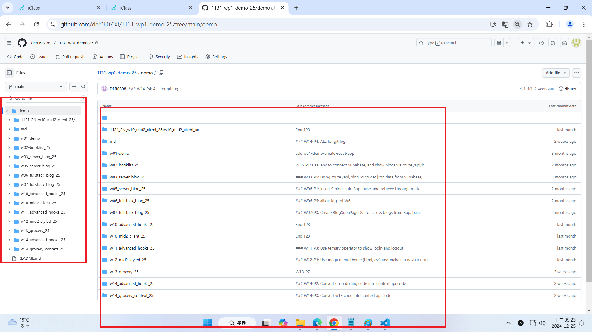
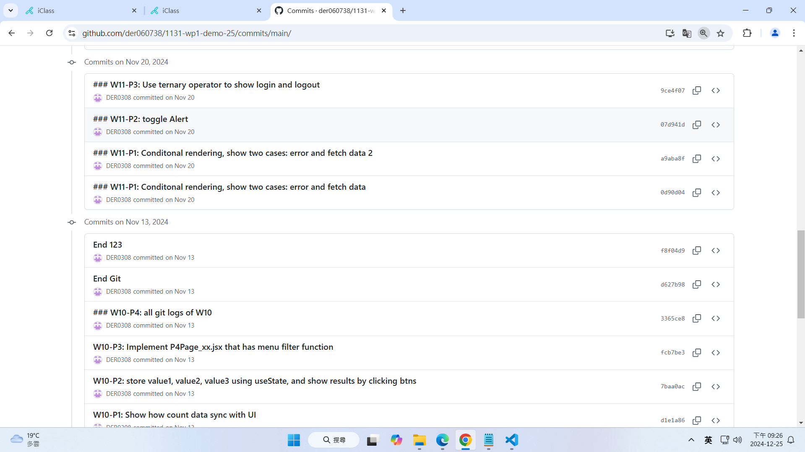
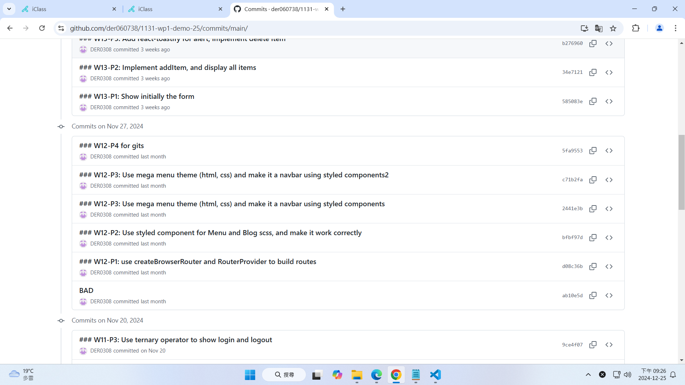
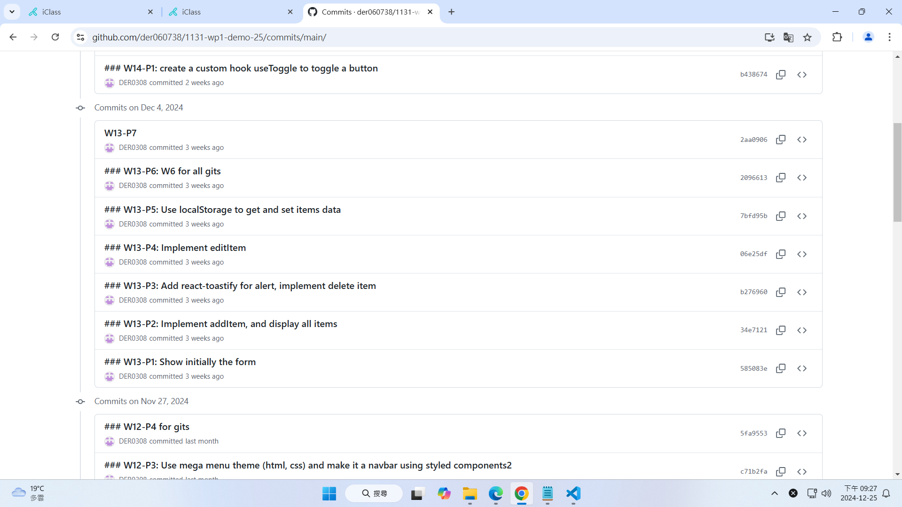
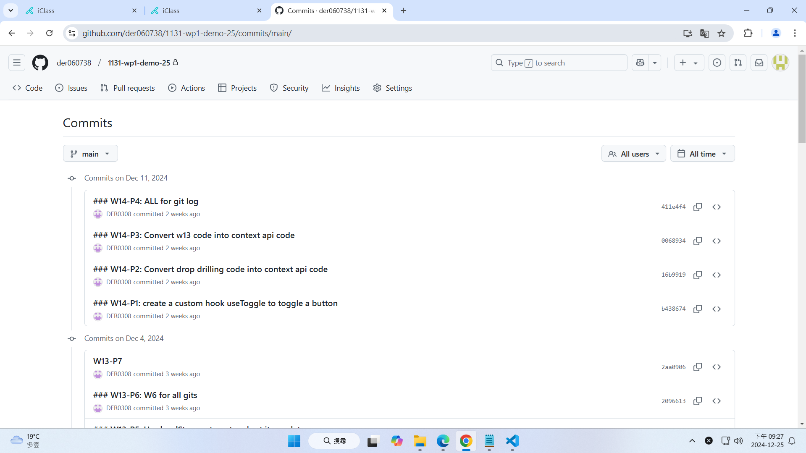
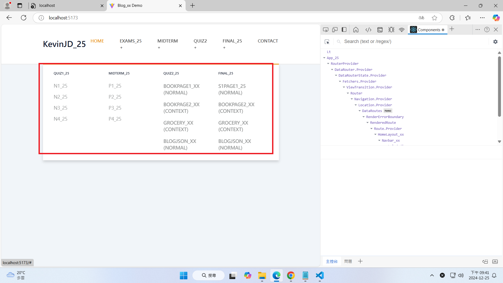
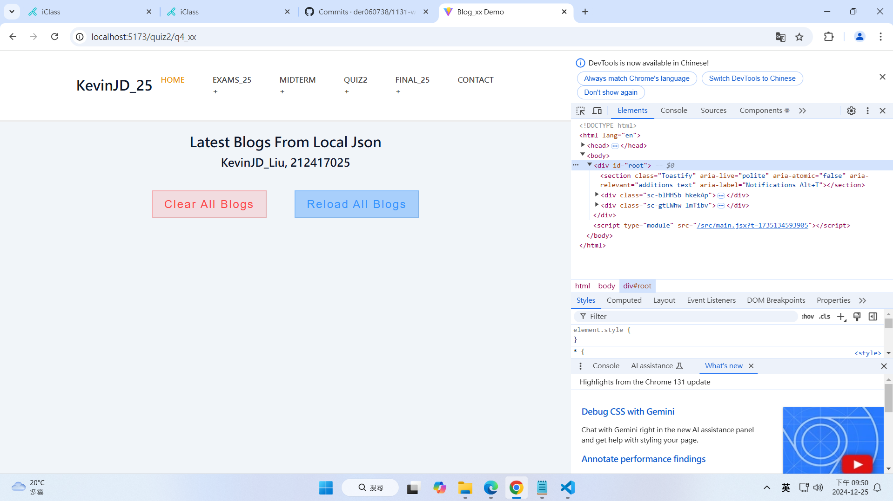

# (40%) Web 程式設計一 期末考 2 -- 開放網路考試

##### 2024-12-25, at E201, 20:50~21:50

#### Note:

1. 請不要發揮同學愛，作弊雙方除了本次考試 0 分外，平常分數另扣 20 分，情節嚴重者會送校。
2. iClass 上請繳交 ans_final2_xx.pdf，還有 md_final2.zip, client_xx (src.zip) 兩個壓縮檔，壓縮前請將 node_modules 全部砍掉
3. 請直接將答案寫在 md_final2_xx/ans_final2_xx.md 上，老師出題及圖片放在 ans_final2_htc.pdf 上，請依照老師所給的圖片來實作並標註
4. 跟小考相關的檔案及目錄名稱有 xx 時，必須要改成學號後 2 碼，沒有修改時，會視違犯情況扣分。
5. 每一張圖片要有機房左側背景，圖片上要有你的學號(或後兩碼)，圖片標註要跟老師所標註的類似。違者會依情節扣分。
6. 請自評分數，將每一題的 ? 填入分數，沒有填者，不會批改，以 0 分計算。

##### Your (Name, ID): (劉俊德, 212417025)

- P1 (6%): 6 分
- P2 (10%): ? 分
- P3 (8%): ? 分
- P4 (16%): ? 分

##### 總分: ? 分

---

#### (6%) P1: Show Your Github Repo for class demo

##### => My Github repo URL

請給予你在 Github 上課 demo 的 URL，點選要能夠連到你的 Github repo

[My Github URL]()

##### => Github 右邊顯示全部的 md，左邊顯示全部的上課 demo

#### Your Answer

##### => My Github repo URL

請給予你在 Github 上課 demo 的 URL，點選要能夠連到你的 Github repo

[My Github URL](https://github.com/der060738/1131-wp1-demo-25/commits/main/)

##### => Github 右邊顯示全部的 md，左邊顯示全部的上課 demo

---

#### (10%) P2: Show your git commits for W10, w11, W12, W13, W14

#### Your Answer

---

#### (8%) P3: 請用 Final1 老師所給的 code，修改 Mega Menu，顯示 quiz1, midterm, quiz2, final exams 中所有的題目編號如下圖，並要能執行 quiz2 中的 BlogJson_xx (normal) 選項。

##### => Chrome 中 Mega Menu 顯示

#### Your Answer

##### => Chrome 中 Mega Menu 顯示

##### => 要能執行 quiz2 之 BlogJson_xx (Normal)，請顯示在 Mega 選單中之設定

只要在路由與選單標示上，如題目要求要顯示你的學號後兩碼，不需要將路由指到的頁面(老師提供)code 之 xx 改成你的學號

---

#### (16%) P4: 將 final1_xx 考題，包含你所完成的結果，放入 一個新的 Github 中，repo 名稱 1131-2N-final-xx，並 push 到 Vercel

##### => 透過 git init 產生 local repo，然後在 Github 建立一個新的 repo，並用 git remote add origin 將 local repo 掛到遠端的 Github repo，指令參考如下圖

##### => Final Github repo URL & Vercel URL

[My Github URL for final exam](https://github.com/der060738/1131-2N-final-25)

[My Vercel URL for HomePage_25]()

##### => 透過 Mega Menu 在 Vercel 上能執行 Midterm P4_xx，可以從 Supabase 執行篩選 Breakfast 資料，路由是 /mid_xx/p4_xx

要記得將 .env 上的環境變數放入 Vercel 環境變數中

只要在路由與選單標示上，如題目要求要顯示你的學號後兩碼，不需要將路由指到的頁面(老師提供)code 之 xx 改成你的學號

##### => 透過 Mega Menu，在 Vercel 上能執行 Quiz2 BookPage2_xx (context)，路由是 /quiz2/q2_xx，截取的圖要顯示 books 是儲存在 context 中。

只要在路由與選單標示上，如題目要求要顯示你的學號後兩碼，不需要將路由指到的頁面(老師提供)code 之 xx 改成你的學號

#### Your Answer

##### => Final Github repo URL & Vercel URL

[My Github URL for final exam]()

[My Vercel URL for HomePage_xx]()

##### => 透過 Mega Menu 在 Vercel 上能執行 Midterm P4_xx，可以從 Supabase 執行篩選 Breakfast 資料，路由是 /mid_xx/p4_xx

##### => 透過 Mega Menu 在 Vercel 上能執行 Quiz2 BookPage2_xx (context)，路由是 /quiz2/q2_xx，截取的圖要顯示 books 是儲存在 context 中。

